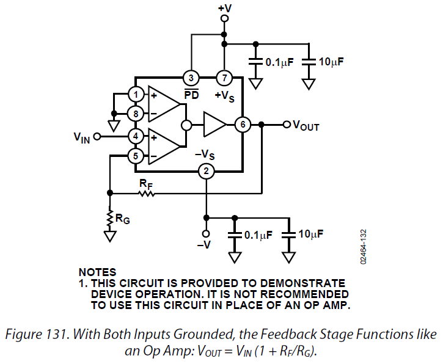
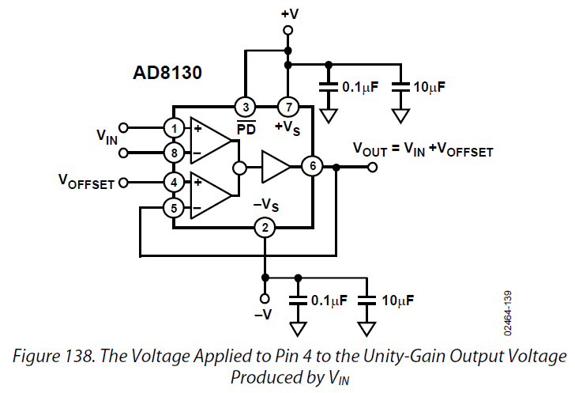
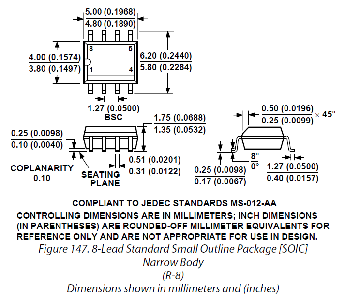
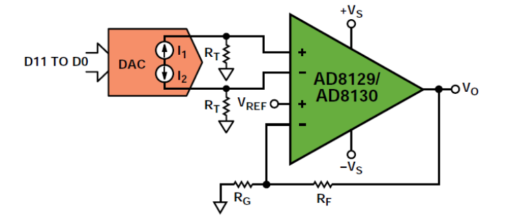
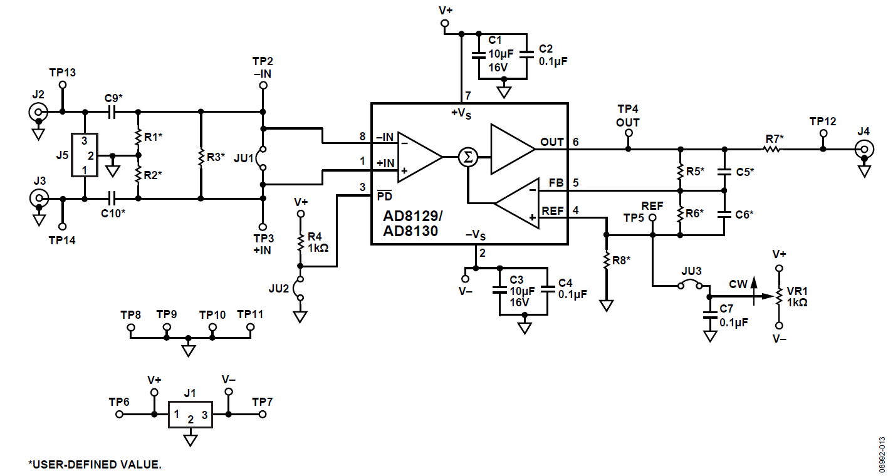

# AD8130

所有关于AD8130的设计心得。

**注意：**AD8130可以直接将`RG`接地，`RF`短接，构成单位增益电路；而AD8129不能使用单位增益电路，否则会引起震荡。其放大倍数一般在`G=10`时保持稳定。

## 参考电路及封装








AD8130的PCB布局布线设计规范：

  1. AD8130属于高速器件，具有业界领先的交流共模抑制特性
  2. 用大范围的地平面铺铜包围AD8130器件
  3. 在FB附近，及多层板每一层FB管脚附近不要布地，避免寄生电容（stray capacitance，杂散电容）
  4. 去耦电容（0.01uF或者0.1uF）应紧靠每一个电源附近（ceramic chip capacitors，低电感多层陶瓷电容MLCC）
  5. 低频去耦电容（10uF）应远离器件，放置于电源附近（tantalum capacitors，钽电容）
  6. 信号路径尽可能短，信号需从地平面上过以避免信号辐射或其他EMI干扰

缺点（慢慢总结）：

  1. 具备有较大的直流偏置电流（dc bias current）

## 功能

AD8130的主要功能是用作ADC或者DAC的缓冲，先看一看基本的电路。

### 1、用作高速电流输出的DAC缓冲器

参考设计来自于`dac_buffers_cn.pdf`



其中`AD8130`的增益为`1 + RF/RG`，输入差分端电压差为`RT(I1 - I2)`，`VREF`可接地。在这个电路里，仅使用单片AD8130即可完成差分单端转化和放大。

### 2、用作ADC输入的转换器

参考设计来自`signal_generator.pdf`或者`signal_generator_cn.pdf`。利用`AD9834`，`AD8338`，`AD8130`、`ADA4870`制作信号生成（DDS）电路。中文文档翻译的不错。

## 参考原理图

### 1、UG133

我们先来看一看`UG133.pdf`文件，需要注意的地方有：

  1. 电源去耦，`C1`与`C2`，注意两者的阻值、耐压和大小，PCB板中的位置
  2. 地平面`GND`是顶层，在背部`+5V`在左，`-5V`在右
  3. 增益控制（`R5`与`R6`），参考管脚可以直接接地
  4. 反馈路`FB`附近，接地平面被移除，以便降低寄生电容，注意看PCB板
  5. `#PD`管脚附近有`1k`的上拉电阻
  6. 输入端接由电阻`R3`控制
  7. 注意：原理图和PCB中的测试管脚的应用`TP`
  8. 注意：输入和输出路径打的洞（`Vias`）




### 2、AN1214或者CN0142


Headroom effect，翻译过来是裕量问题。这段话主要解释电路中放大器输入端接电阻`49.9`欧姆与`AD9117`的最大输出电流`20mA`与最大输出电压`1V`的关系；另一方面，需保持`AD8130`供电电路的稳定。手册中还提到，
```
AD8130的270MHz带宽会限制上升/下降时间和建立时间。该电路仍然可以在3次DAC更新（125MSPS）的时间内建立。
```

对于集成DAC和放大器的电路，建议PCB至少是四层板，一层地一层电源，两层信号，合理处置去耦。
