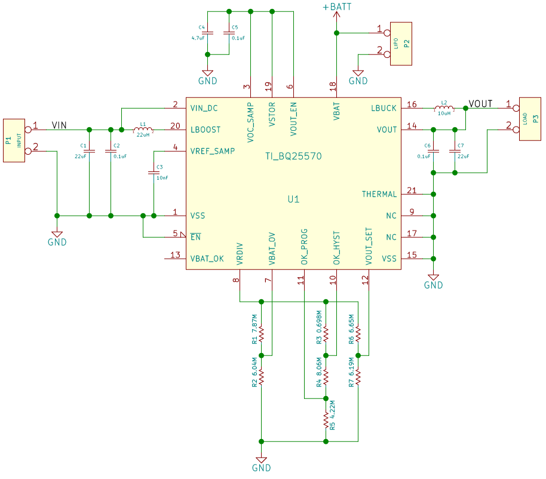
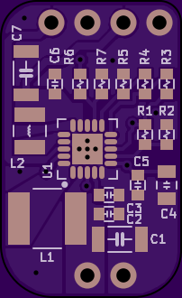
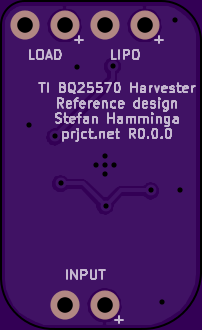

# Awesome-kicad

可以到[made-with-kicad](http://kicad-pcb.org/made-with-kicad/)查看。对于大型的项目有`A64-OLinuXino`、`Crazyflie 1.0`、`HackRF`等。

展示自己收集的漂亮的kicad原理图和pcb板。

## 1. StefanHamminga

主页在：[prjct.net](prjct.net) 他自己制作的封装（footprint）也很漂亮、很有特色。可以在他自己的[StefanHamminga github](https://github.com/StefanHamminga) 上找到。

下面列举一二：

