# 如何布局布线Ethernet

## 1. 概览与设计原则

建议使用 RJ45 with integrated magnetic.

来自[EthernetRoutingGuidelines](http://hands.com/~lkcl/eoma/kde_tablet/EthernetRoutingGuidelines.pdf)

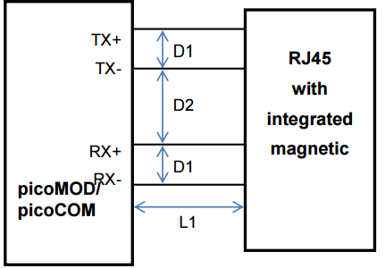

  1. 信号必须用100R(10%)阻抗匹配的差分布线。D1一般为6.8mil，差分对的skew必须小于50mil(1.25mm)
  2. 两对差分线之间的距离差异必须小于700mil(18mm)
  3. 尽量不使用Vias。如果必须使用vias，vias也必须匹配（**how？**）
  4. D2距离必须大于100mil（2.5mm），避免干扰
  5. RJ45接口极其磁下面不能布置电源平面或地平面
  6. L1的距离必须尽可能短，不要超过4inch（100mm）

除此以外，我们也参考下Microchip的设计原则，来自 [LAN7500/LAN7500i Layout Guidelines](http://ww1.microchip.com/downloads/en/AppNotes/en562767.pdf)

  7. 可以在差分对之间插入地平面以及vias，进行隔离。
  8. 使用带金属外壳（shield）的RJ45接口，外壳接入外壳地。
  9. 为了提升ESD性能，可以a、使用不包含LED的RJ45接口，b、使用表贴RJ45。
  10. 对chasis ground进行隔离以及利用Ferrite Bead单点接地。

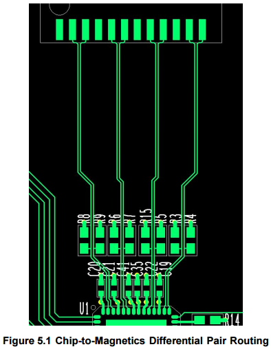

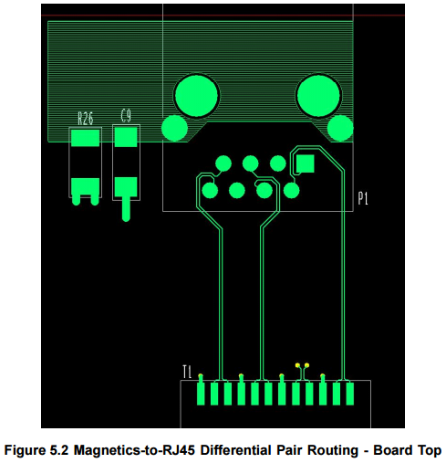
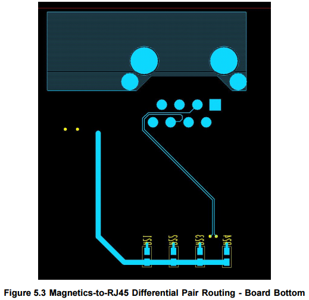

## 2. 典型原理图

典型的原理图见下图。是一个典型的10/100Base传输设计，并且不传输电。

来自

[PCB Layout for the Ethernet PHY Interface](http://ftp1.digi.com/support/documentation/022-0137_F.pdf)

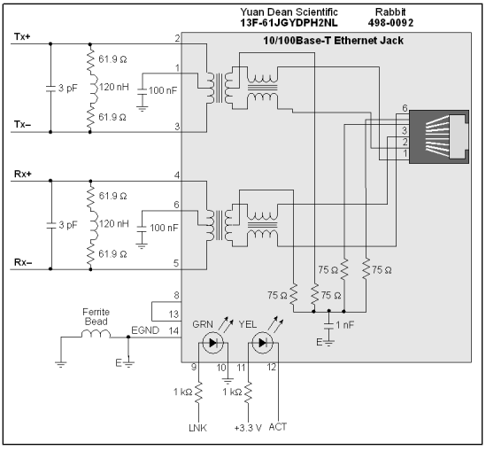

我们再来看看凌特是怎么设计的，主要设计领域是POE。

[Small Highly-Integrated Highly-Efficient Non-Isolated PoE Powered Device](http://cds.linear.com/docs/en/demo-board-manual/DC2125AF.PDF)

[Single Port IEEE802.3at PSE](http://cds.linear.com/docs/en/demo-board-manual/DC1567BFA.PDF)

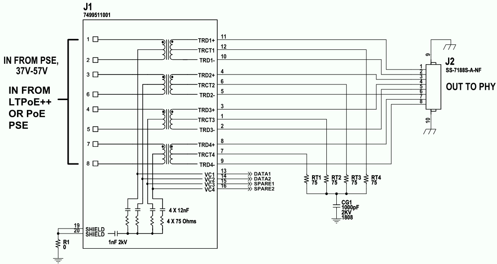

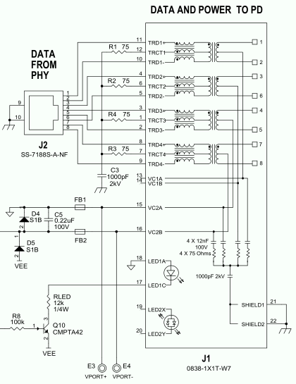

VCT是Center Tap Voltage的缩写。Ethernet applications and not for RS485, as RS485 usually does not use **dc-biasing** on the bus lines. This biasing would look to RS485 like a low-impedance common-mode voltage. VCT 可能是输出共模电压用的。对于理解VCT，需要掌握current mode和voltage mode两种模式。

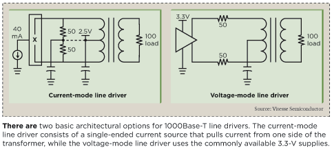

对于电流输出的PHY，需要加入VCT电压；而对于电压输出的，直接bypass就行。

## 3. 阻抗匹配

但是缺少了阻抗匹配，我们来研究下1000Base怎样做阻抗匹配。在PCI Express的标准中，差分信号需要Zdiff=100 ohms +/- 20%，传输阻抗Z0=60 ohms +/- 15%。在Kicad中怎么评估传输阻抗呢？

## 4. 直接使用RJ45传输LVDS信号不行么？

1、为什么要用magnetic隔离？

参看这个问题：
[Why Are Ethernet/RJ45 Sockets Magnetically Coupled?](http://electronics.stackexchange.com/questions/27756/why-are-ethernet-rj45-sockets-magnetically-coupled)

The correct answer is because the ethernet specification requires it. The problem is that ethernet can support fairly long runs such that equipment on different ends can be powered from distant branches of the power distribution network within a building or even different buildings. **This means there can be significant ground offset between ethernet nodes.** This is a problem with ground-referenced communication schemes, like RS-232.

如果直接用FPGA背板传输数据，当PHY工作在电流模式下时，只需消除DC-biasing即可。方法是利用Cap进行隔离**（是否可行有待验证评估！）**。参考文献[AN-1519 DP83848 PHYTER Transformerless Ethernet Operation](http://www.ti.com/lit/an/snla088a/snla088a.pdf)。
进行测试，隔离电容可以使用0.1uF或者33nF，性能类似。**Recommendations include the use of 33 nF or larger non-polarized capacitors for DC isolation** from a network cable, with a minimum DC isolation rating which suits the individual application.

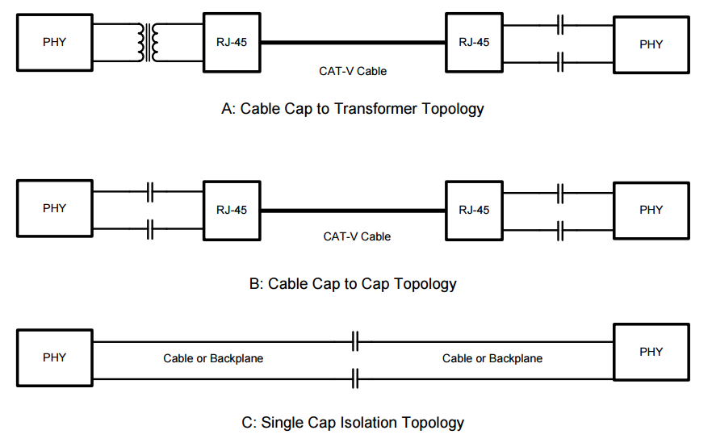

2、LVDS的特点（缺点）

First when the LVDS signals drive cable, it requires shielded cable, use CAT5, 5e and CAT6 with shield cable. Second, LVDS solution can not be used in some application requires signal isolation. And transformer does. Like DC isolation.

## 5. 评估

看TI的文档
[Performance of LVDS With Different Cables](http://www.ti.com/lit/an/slyt163/slyt163.pdf)

  - LVDS, as standardized in TIA/EIA-644, specifies a theoretical maximum signaling rate of 1.923 Gbps.
  - TIA/EIA-644 LVDS specifies the use of 90-Ω to 132-Ω transmission lines (although other values may also be used in nonstandard applications).
  - Use shield/unshield CAT5, CAT5+, CAT6 cables.
  - The dc resistance of the cable should not exceed 9.38 Ω/100 m.
  - The mutual capacitance is limited to a maximum of 5.6 nF/100 m.
  - Termination is used at the end of a transmission line to minimize reflections back into the line, and when using LVDS with its high switching speed, termination is mandatory.
  - For this report, a 100 Ω differential termination across the inputs of the LVDS receiver is used.

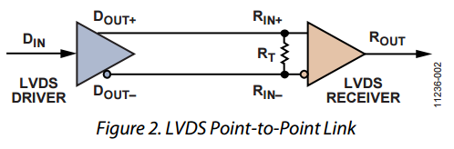

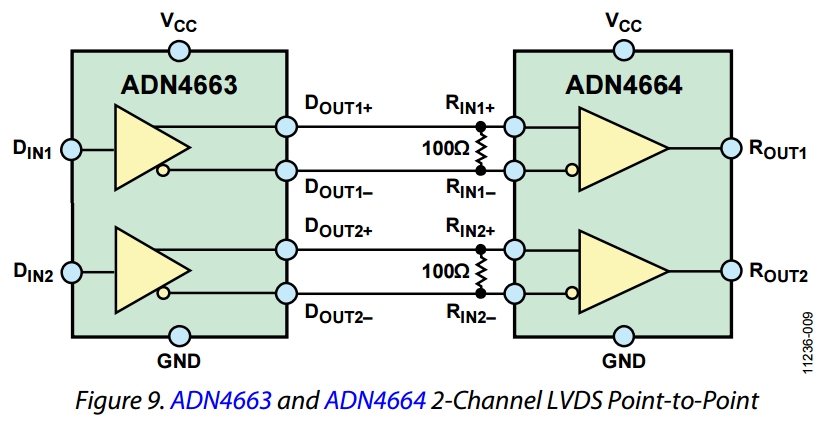

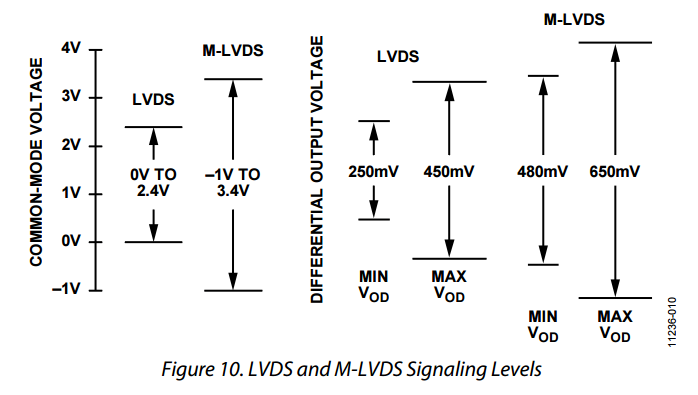

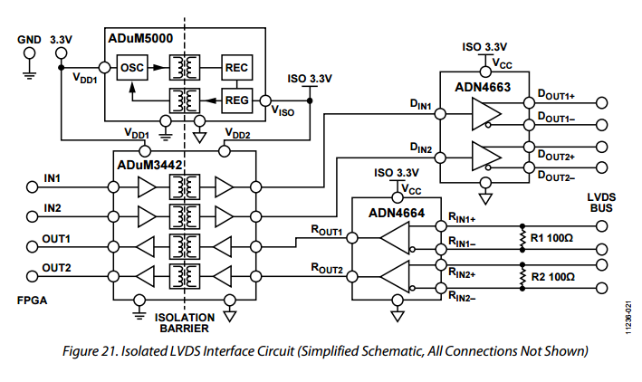

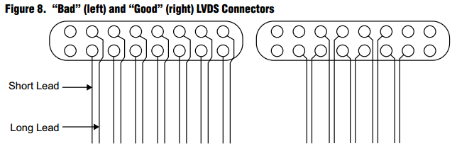

貌似LVDS的输出不需要Capacitor。最好的性能是使用 shield CAT5/CAT5+.

**结论：直接用RJ45传输LVDS数据，后续可以考虑Magnetic隔离，VCT直接对地解耦**
