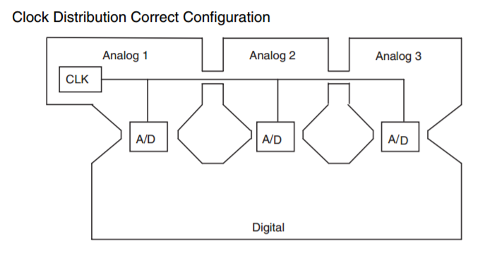
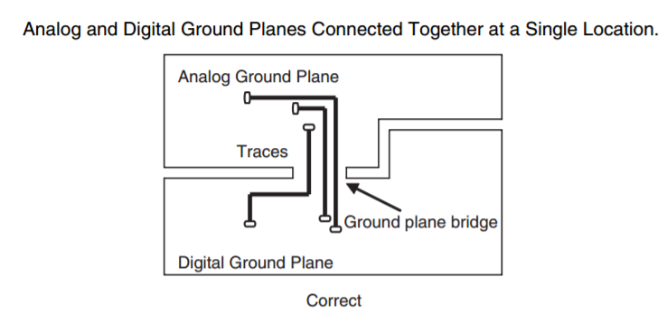
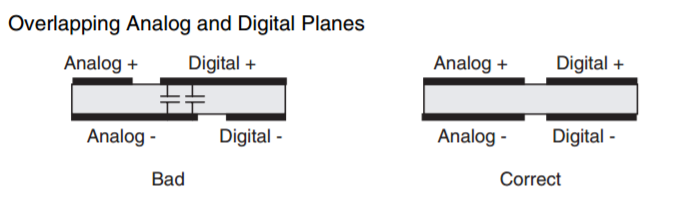
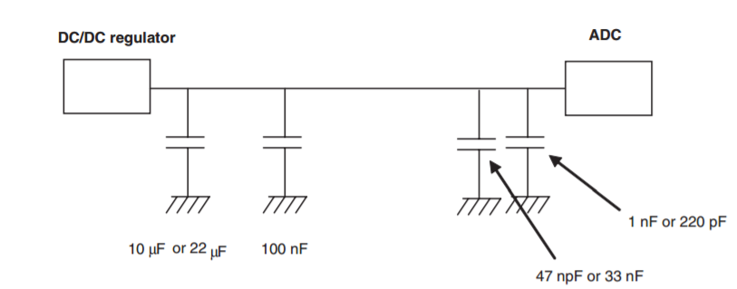
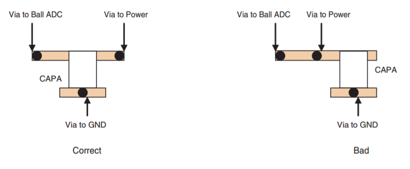

# PCB Layout

## 1. Ground

杂记：

  - 如果不确定怎样布地，那就制作一个完整的地平面。一般PGND、DGND、AGND、EGND只有当干扰很大时才需要隔离，添加FB或者二极管容易产生压差。在Maxim的教程中有讲解。
  - 多看芯片手册的布局布线建议
  - Learn the nature of "path of least resistance" and "path of least impedance"
  - Make sure the path first reaches the cap before the via to the ground plane. Thus: chip - cap - ground
  - Partition but not split ground planes. TI recommends to start with split grounds, route all signals over corresponding ground planes, and in the final step remove the split.

来自 **Henry Ott Consultants** ，当然模拟部分区域也能全部联通起来。对于数字地以及高功率的数字输出（high power motor），也可以通过类似的方法进行处理。

  1. If the current is not returned locally and compactly, it creates **a loop antenna.**
  2. If a system has two reference planes, it creates **a dipole antenna**
  3. (split planes) Another possibility is with a true differential signal, where the signal flows down one trace and returns on the other trace.
  4. **Component placement and partitioning** are, therefore, critical to a good mixed-signal layout.

另外需要注意的是ADC以及DAC的AGND以及DGND，这两个地只是说明内部地是如何连接的，在布局布线时，都应该连到模拟地上，因此必须与AGND解耦。最好的情形应该是数字电路单独放在一块板上，模拟电路放在另一块，这种独立的设计。

来自 **E2V: Design Considerations for Mixed-Signal PCB Layout**

看下仙童公司的PCB层的设计建议。

