# 布局布线的设计、层设计、差分布线及阻抗匹配

## 1. PCB布局pitfalls汇总

  1. 设计模块时，一定要考虑电源的注入方向
  2. 设计外设时，一定要跟FPGA的bank相对应起来
  3. 设计外设时，布局布线阶段一定要考虑接口的输入输出方向
  4. 提前设计好规则，后面不要随意更改

FPGA绘制电路板时，元器件的放置特别重要。合理的设计接口以及布置元器件，可以极大程度的减少PCB连线的困难。另外，原理图的设计需要阅读很多的Datasheet。

## 2. PCB层的设计

### 2.1 Intel的层与设计

PCB的设计是一个综合考虑多方面因素的结果。例如Intel的文档中所说。

```note
A collaborative effort between the layout, signal integrity, hardware
engineer and manufacturing (fabrication/assembly) vendor is key to
ensuring that all parameters are met and incorporated into the stackup.
```

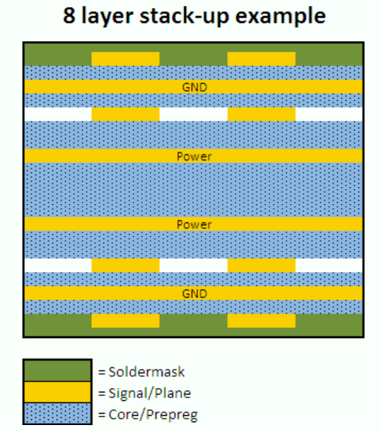

  - Two external signal routing layers (microstrip)
  - Two internal signal routing layers (stripline)
  - Four internal layers which are dedicated for power and GND planes.
  - Soldermask on the outer layers
  - Core or Prepreg layers between each signal layer. Typically a prepreg layer will be used on the outer layers then it will alternate between prepreg and core material. Core material or cured fiberglass epoxy resin refers to a thin piece of dielectric with copper foil bonded to both sides. Prepreg material or uncured fiberglass epoxy resin will cure during the heating and press stage of fabrication.

Depending on the design, the material selection, dielectric thickness and copper weight will have a significant impact on the trace widths and spacing needed for proper controlled impedance values.

所以说多层对于信号质量、EMI、阻抗匹配都是有利的。

### 2.2 Avnet的层与设计

例如，Avnet的Microzed FMC板的层设计是。采用FR4，1.6mm（63mil）

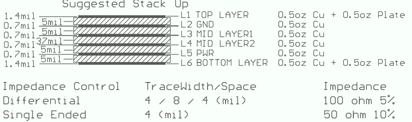

我们可以用Saturn的工具计算。注意在Top和Bottom的是Microstrip，MID Layer 1和2是Embeded Microstrip或者叫做Stripline。

**注意：怎么计算得到的？还没有做出来。**

### 2.3 传输线与特征阻抗

特征阻抗就是分析无穷多个（无穷小）的LC网络。

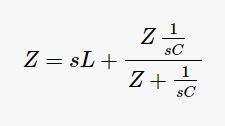

进行求解（二次函数），就可以发现特征阻抗的表达式Z0。分为实部与虚部两部分。

注意：在计算特征阻抗（Characteristic Impedance, Z0）时，参考plane可以是Ground或者Power，但一定要保证GND平面和PWR平面之间阻抗足够小，通常需要加入解耦电容（Decoupling）。

有关参考平面的解释，可以看 **What is Actually Happening when a High Speed Switching Signal is Sent Down a Trace**。写的很不错，有几个观点（重要）：

  1. 参考平面的电流“回流”，仅仅是因为传输线传输信号时，产生电磁感应导致的感应回流电流（The Electro-Magnetic force will create current flow with in a conductor），不需要“回流”也能工作（The Electro-Magnetic force does NOT need a ‘Return’ circuit to work.）
  2. Running a trace over a break in a plane? In a word: Don’t!

### 2.4 传输线的回流解耦

另外，在[aerospacepal.com博客](http://www.aerospacepal.com/4-layer-pcb-stackup-emc/)上，还有关于跨层解耦的解释，在这里面，它的四层布置是这样子的。

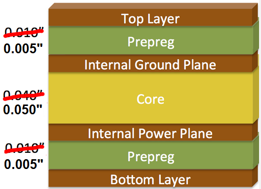

In the 4 layer design discussed the Layer 1 signals will have a high frequency return current on layer 2. Layer 4 will have a high frequency return current on layer 3.

This means that if a signal moves from Layer 1 to Layer 4 you want to have the return current change planes from Layer 2 to Layer 3. If the return current cannot change layers the loop area is increased.

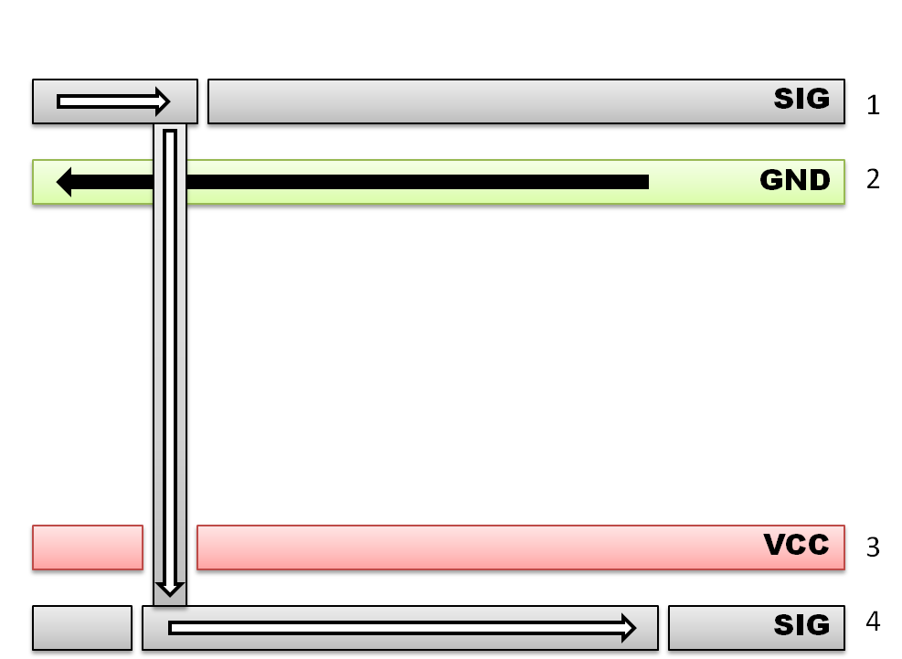

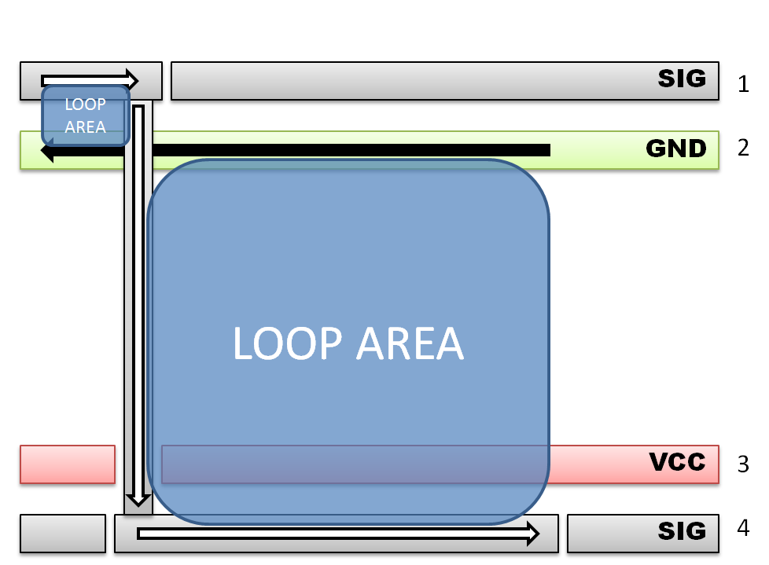

也就是说信号从层1切换到了层4，如果参考层来不及切换，就会形成较大的回路。解决办法就是在切换地方放置解耦电容。To reduce the loop area on sensitive signals you just need to add a decoupliung capacitor or bypass cap in close vicinity to where the signal changed planes. I would recommend the component be added within 100 mils or 2.54mm. This allows the return current to transfer from layer 3 to layer 2 as seen below.

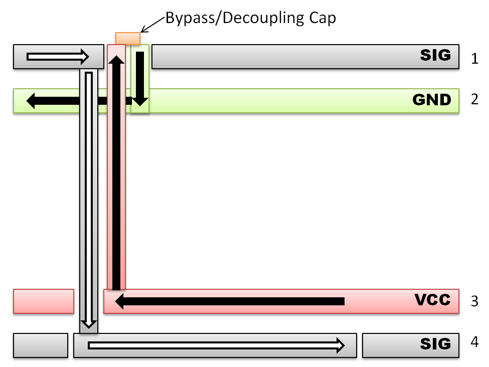

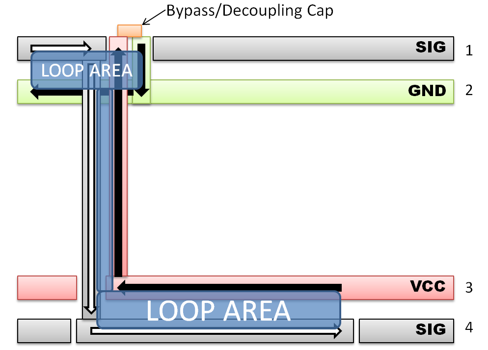

目的就是创建（感应）信号回流通道。

### 2.5 更多的层与设计

阅读[Polar](polarinstruments.com)的文档

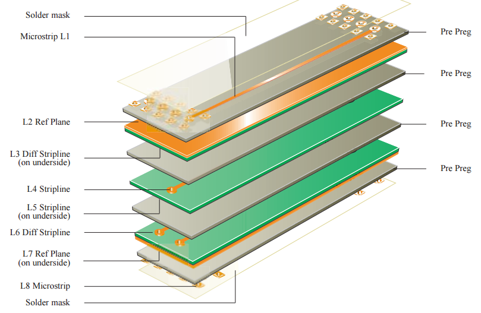

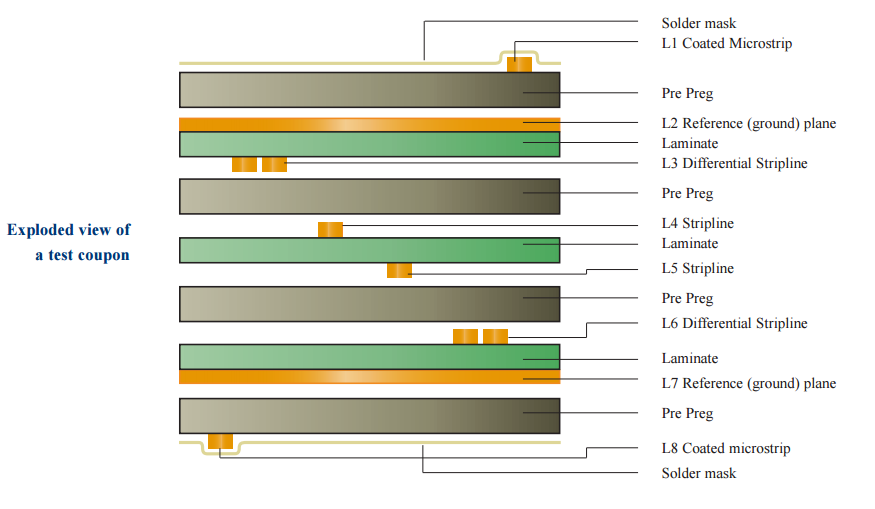

### 2.6 Altera的FPGA设计要素

阅读Altera的PCB Stackup Design Considerations for Altera FPGAs (AN613)。

当存在多个电源位于不同的层时，要注意电源和电源之间不要有太多重合区域。

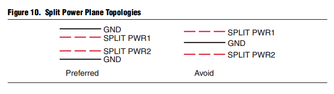

电源线的宽度与敷铜厚度的关系。

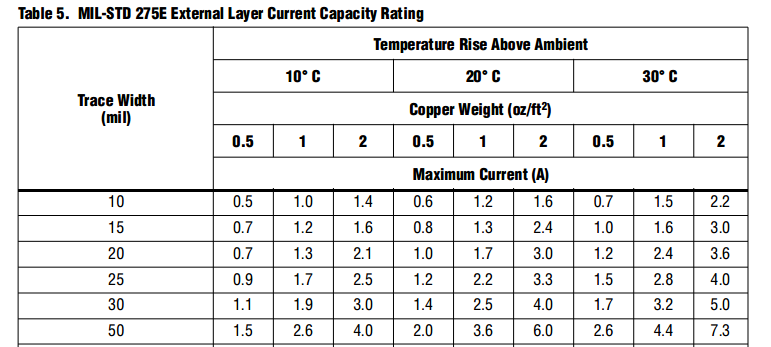

## 3. 心得

**首先、**PCB设计环节中，设计规则以及分层设计都是需要提前考虑的。例如，如果进行阻抗匹配，那么地层和信号层应该怎样绘制，输入输出接口集中的、统一的放置在哪一边等等。

**其次、**考虑EMI的影响，同样对层的设计有约束。

**例如、**典型的4层板是（1）LVDS/高速信号、（2）地、（3）电源、（4）TTL信号，使用FR-4，1.6mm时，典型（嘉立创）的设置是0.2mm preprep，1.2mm Center dialetric，0.2mm preprep。若进行阻抗匹配，例如50欧布线时，可以考虑使用5mil或者6mil的preprep。当需要考虑EMI时，可以使用（1）GND、（2）Signal/PWR、（3）Signal/PWR、（4）GND这样的设计。好处是便于进行阻抗匹配，并且（Faraday Cage）进行屏蔽。坏处是电源和地之间距离太近。

**阻抗匹配、**可以使用Saturn的工具进行计算。外层的是Microstrip，内部的是Stripline。
