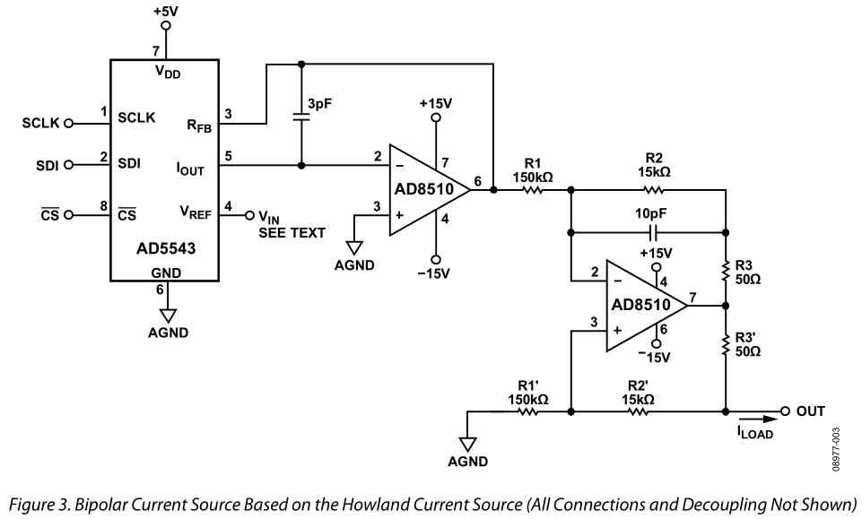
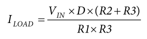
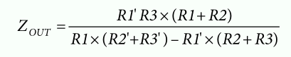
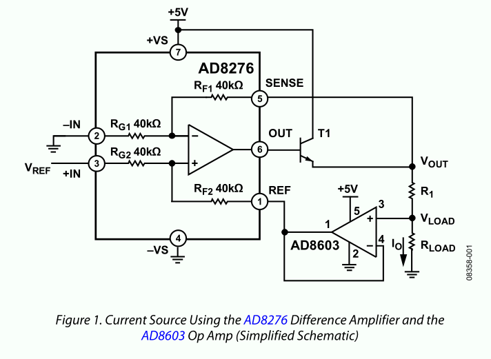
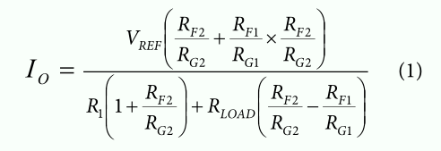
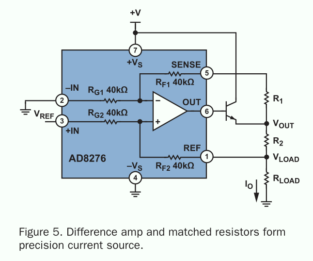
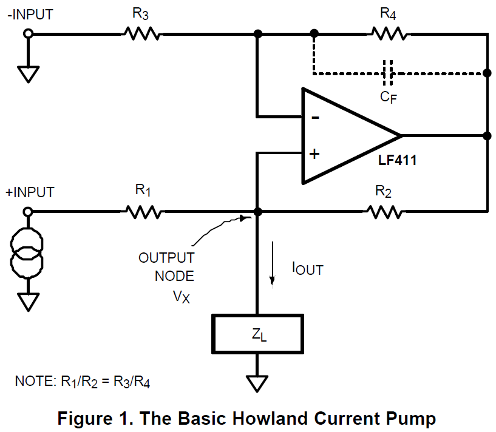
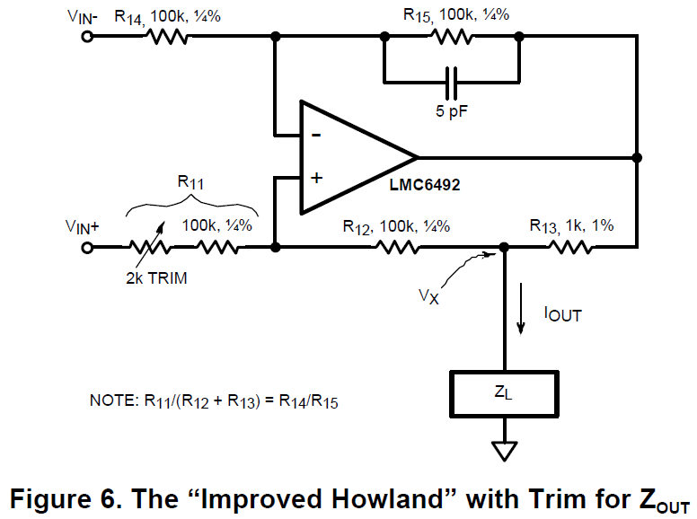
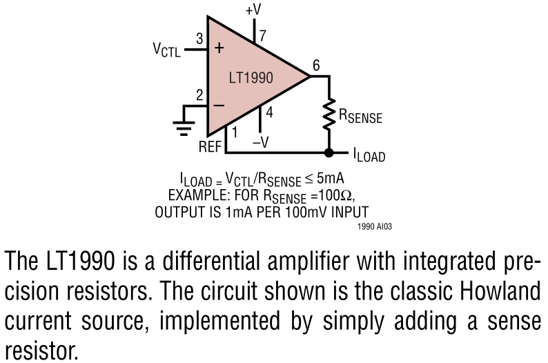
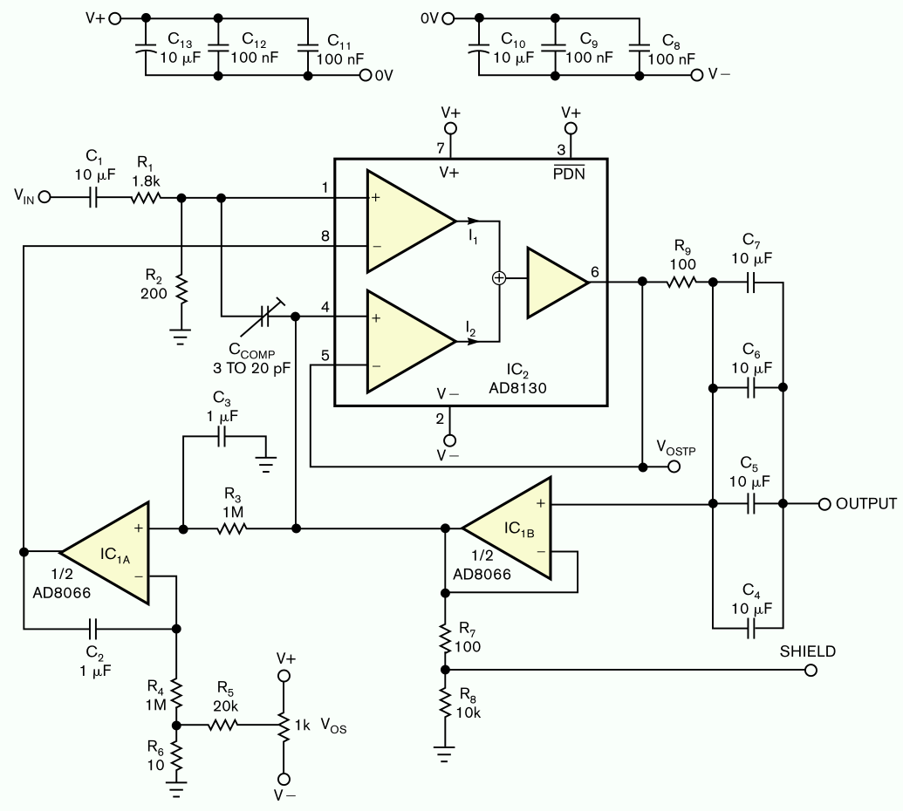

# VCCS and Current Sense Circuit Collections

电流感知电路在一定程度上与恒流源是类似的，其设计目的是：维持恒定的电流监测（sense）或激励（output）能力。

## 文献的研究成果

简单总结一下文献中的研究要点（Improved/Enhanced Howland Source）

 - Wang Yinan 研究了增强型Howland电流源，并研究了双运放的设计方法。器件：单运放使用`OPA843`，双运放使用`OPA843`与`OPA653`。其中`OPA653`只是用于GIC（General Impedance Converter）。
 - Tucker 等人研究了改进型Howland电流源，并提出在运放输入端短接RC补偿电路（Lead-Lag），初步估计在这一简单的电流源上，可以实现1MHz的3dB带宽。

## Howland电流源设计要点（Analog/TI/Apex）

主要阅读：

 - AD的文档`CN0151.pdf`（最早的原型或设计思路可见 `SBOA046`）
 - AD的文档`CN0099.pdf`以及模拟对话 Difference Amplifier Forms Heart of Precision Current Source
 - TI的文档`AN-1515.pdf`
 - Apex的文档`AN13.pdf`

### 1、Analog CN-0151

先看`CN-0151`中的参考电路。我们直接看Howland的图

若选择差分互补型电流输出DAC，则还可以用AD8130做输出缓冲。输出电流为（假设电阻完全匹配）：

输出阻抗**（存疑，例如，对于图中的设置，当完全匹配时输出阻抗几乎是无穷大）**为：

公式中`R3`需要远远小于`R1`或者`R2`，D是DAC的输出比例（fractional words）。Howland电流源对电阻匹配和电阻精度要求较高，一般需要达到0.1%的数量级，并且最好使用**高精度、一致性高的电阻**。

文章中还提到，Howland型（前者）输出相对于MOSFET输出（后者）的优点、缺点分别是

 - 高输出阻抗（相对比而言，在低频段有高输出阻抗）
 - 提供双极性输出（Bipolar output current）
 - 缺点：Howland电路要求电阻一致、高精度匹配（可以用排阻），并且对PCB板设计的要求较高

### 1、Analog CN-0099

CN0099采用差分放大器构建精确电流源，但是该设计能否适用于大带宽情形仍有待确认。

CN0099中的核心电路为：

当驱动能力足够（或所需求的电流较小时）时，NPN也可以省略。
采用单电源供电时，工作在单极模式。采用双电源供电可以输出双极电流。
AD8603运放的要求是漏电流极小。

在这种情况下，电流计算公式为（当RG1=RG2=RF1=RF2时可以化简）：

模拟对话中除了跟CN0099类似的之外，另外一个核心电路为：

需要R1和R2精确匹配，否则电流大小将根据Rload不同而不同。电流计算公式为：

### 2、Apex AN-13

Apex的文档指出，反馈支路的电阻需要调节匹配以便实现最佳的电流源

> The circuit of Figure 8 actually required a slight amount of mismatch
> in the two (RF) resistors to compensate for mismatches elsewhere,
> suggesting that the inclusion of a trimpot may be necessary
> to obtain maximum performance.

### 3、TI AN-1515

最后，我们通过文档`AN-1515.pdf`来研究Howland电路的设计要点。这篇文献需要重点阅读。

基本Howland电流源：

重点放在改进型Howland电路：

若匹配做的不好，还有可能出现负输出阻抗的情况。四个电阻可以用排阻，并使用`R13`和`R13'`高精密电阻进行匹配。

## 利用AD8130设计电流源电路

主要参考文献：

 - Bipolar current source maintains high output impedance at high frequencies
 - A comparison of different Current Sources for multi-frequency Impedance Spectroscopy

### 1、原理

基本原理可见Linear的文档：`AN-105: Current Sense Circuit Collection`

主要包括以下几个部分：

### 2、ac coupling circuit

就是交流耦合输出。AD8130电流源的本质就是上图，自行分析。

> the AD8130's relatively high input bias current can affect output-current accuracy at low current levels.

 - 使用单位增益反馈放大器隔离输出和输入
 - 使用交流耦合输出的电路，可以使用`dc servo loop`来稳定（stabilize）电路的`operating point`。也就是创建直流流出电路（若都用AC耦合，则直流无法流出）

### 3、dc stabilization circuit

DC工作点稳定电路，其功能就是在AC耦合输出或者没有DC流出支路的情况下，创建反馈电路，保证放大器稳定工作。另外一种说法是为了在较小电流输出时能有精确的控制能力。

发现大学期间学习的Laplace变换用于电路分析还是很有用的嘛。

### 4、补偿电路

在Tucker等人的文献中，也叫作`lead lag`补偿电路。在标准设计中，仅包含一个3到20pF的补偿电容`Ccomp`，用以补偿杂散电容的影响。

## 绘制原理图

我们在AD8130的基础上制作两个原理图，其一是单运放的，其二是双运放加入`dc servo loop`的电路。分别参考kaufmann的论文和Alex Birkett的文章。最终PCB制作成载板的形式。
